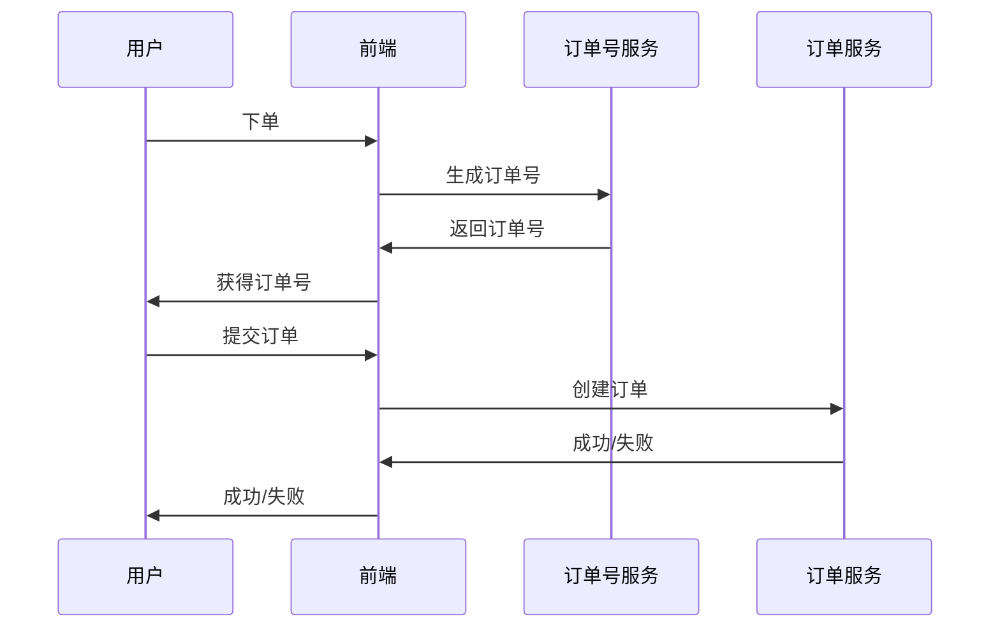
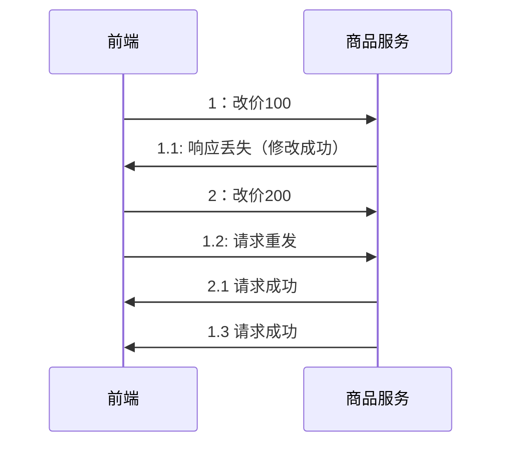
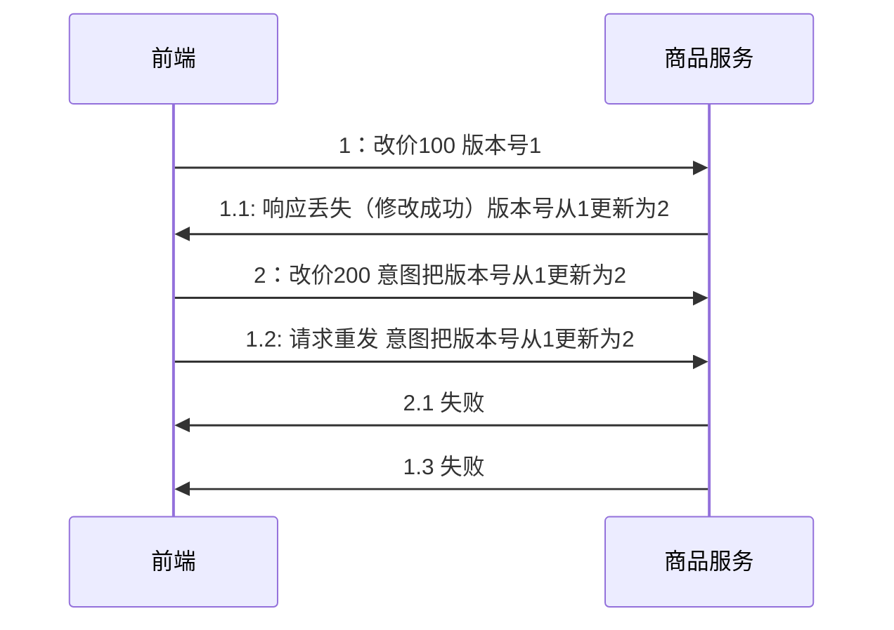

## 如何实现接口幂等性（重复调用）

* 在平时的调用中，由于用户点击两次、网络波动等原因，经常会放生同样的请求发送两次的情况。作为后端存储系统，要对这种情况有处理能力，保证不管是请求一次还是多次，请求的结果是一样的。这就是接口的幂等性实现。

### 解决方案

* 利用数据库的主键唯一约束，在插入数据时带上主键，而不是自动生成
* 以电商项目为例，项目架构如下:

* 特别的，如果是由于重复插入导致的失败，不要把错误展示给用户，否则会造成误导

## 如何解决ABA问题（调用顺序）

* 在高并发环境下，可能会在短时间内对一条数据做多次更新
* 对数据的更新，本质是一次数据库的update。如果，第一次更新由于某些原因，没有立即生效（网络延迟等），第二次更新先生效，此时数据又被更新为第一次请求的数据。这就是著名的ABA问题

* 上述场景，就会当值更新数据的错误，数据最终被错误的更新为第一次请求的值

### 解决方案

* 在数据库中增加版本号的列，在修改数据时，where条件中增加当前版本号，并在修改数据后，给版本号+1
